---
output:
  html_document:
    toc: true
    toc_depth: 2
    number_sections: false
    theme: paper
    code_folding: none
    toc_float:
        collapsed: false
        smooth_scroll: false
---

::: {.cell}

:::

::: {.cell}

:::

NOTE: So far, this is the only page that attempts to "fix" the 10,000+ CVEs with an incorrect published date and that's the primary date field used throughout. Some of the charts and graphics may not match with other pages (who incorrectly trust the published date).

The major sections in a CVE record are:

-   metadata - CVE ID, dates, CNA information, etc
-   Description and Title - free text information about the vulnerability
-   Affected - information to identify entity/entities affected by vulnerability
-   Problem Types - CWE information
-   References - URLs to external related sources
-   impacts
-   metrics
-   configurations
-   workarounds
-   solutions
-   exploits
-   timeline
-   credits
-   source
-   tags
-   taxonomy mappings
-   x\_\*

The following section looks at general completeness and statistics about each section.

## Affected (defined with version(s))

Points in the plot are monthly proportions with field, the lines are rolling 90 day windows before the specified time. Showing data with and without "MITRE" listed as the CNA.

::: {.cell}
::: {.cell-output-display}
{width=672}
:::
:::

## Affected: CPEs

::: {.cell}
::: {.cell-output-display}
{width=672}
:::
:::

## Problem Types (CWE Defined)

::: {.cell}
::: {.cell-output-display}
{width=672}
:::
:::

## References - Average number of references per CVE

Note that "average" is using a geometric mean to calculate the average over time.

::: {.cell}
::: {.cell-output-display}
{width=672}
:::
:::

## References: CVES with 3 or more

::: {.cell}
::: {.cell-output-display}
{width=672}
:::
:::

## References: Top Tags

::: {.cell}
::: {.cell-output-display}
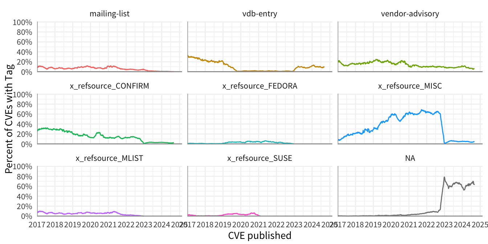{width=672}
:::
:::

## Impacts

Personally, "attack patterns" and "impact" are two very different things, so I find it strange that CAPEC is specified in the "impact" section.

::: {.cell}
::: {.cell-output-display}
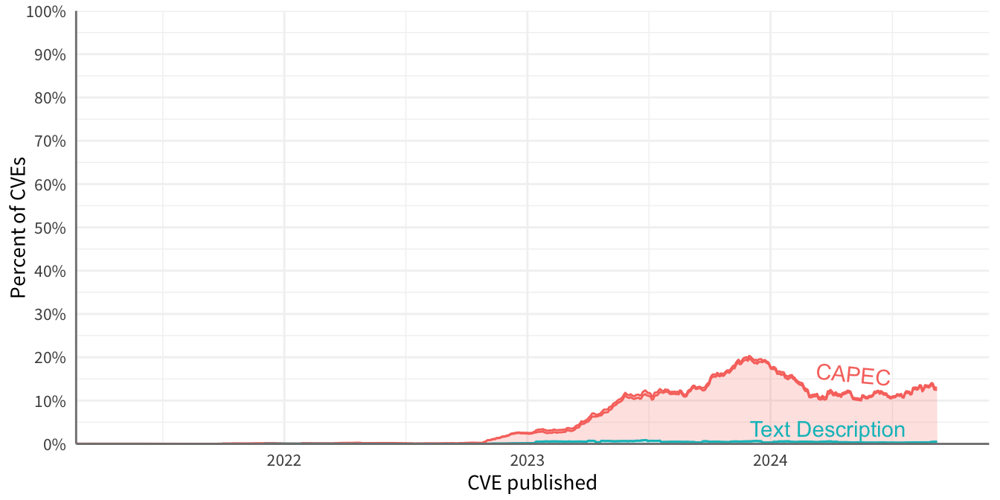{width=672}
:::
:::

## Metrics

Note that containers.cna.metrics.other is an object with a free text "type" field and an object named "content" which "supports arbitrary JSON". In the CNA container, it looks like most if not all of the "other" metrics is mostly just a free text description of the outcome or impact.

Also, not counting the "scenario" field here. As of 2024-09-07, there were 20,282 CVEs with a scenario, but when we remove the scenario of "GENERAL" we are left with 48 CVEs.

::: {.cell}
::: {.cell-output-display}
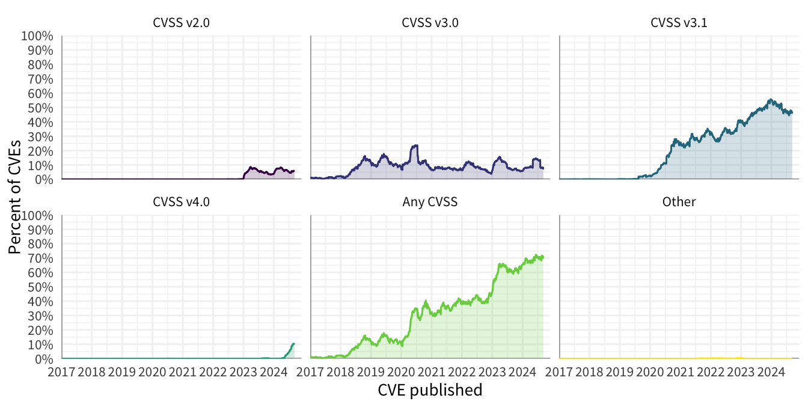{width=672}
:::
:::

::: {.cell}

:::

## Configurations

::: {.cell}
::: {.cell-output-display}
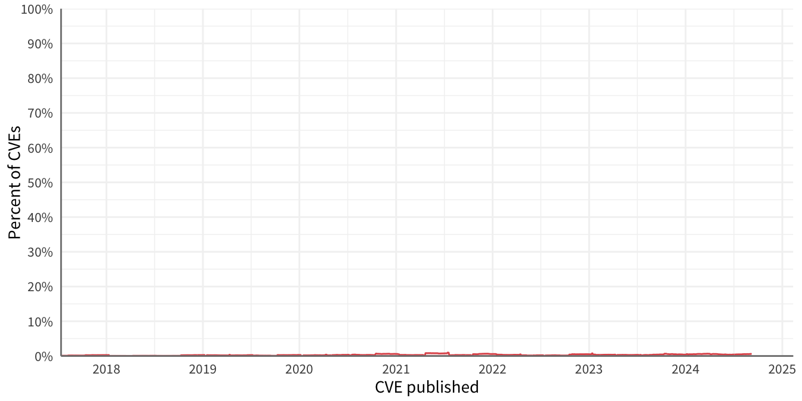{width=672}
:::
:::

## Workarounds

Removing obvious non-answers such as "There are no \[known\|viable\|available\] workarounds" and others.

::: {.cell}
::: {.cell-output-display}
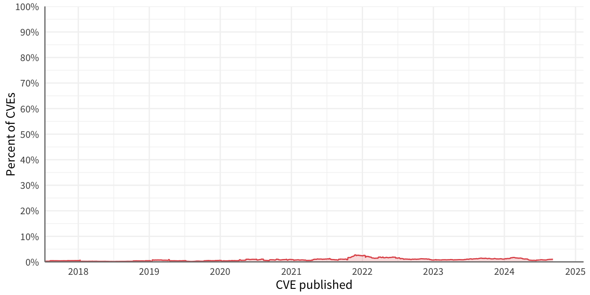{width=672}
:::
:::

## Solutions

::: {.cell}
::: {.cell-output-display}
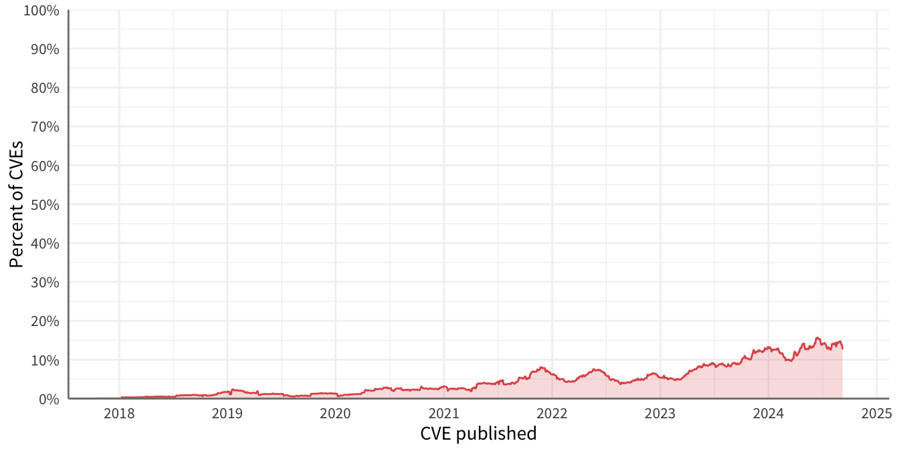{width=672}
:::
:::

## Exploits

Removing non-answers such as "not aware of" and "None publicly available".

::: {.cell}
::: {.cell-output-display}
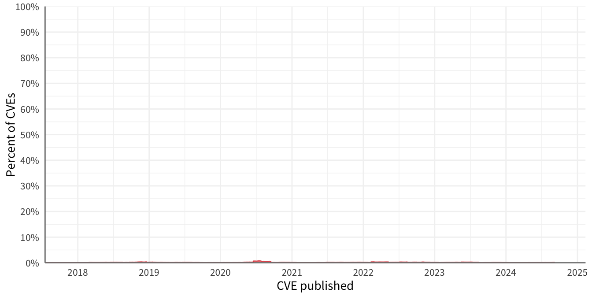{width=672}
:::
:::

## Timeline

::: {.cell}
::: {.cell-output-display}
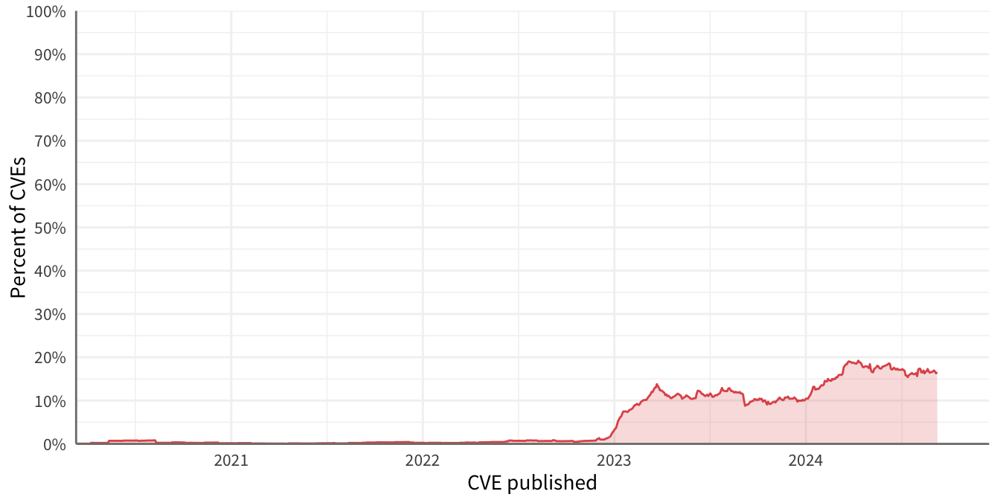{width=672}
:::
:::

## Credits

::: {.cell}
::: {.cell-output-display}
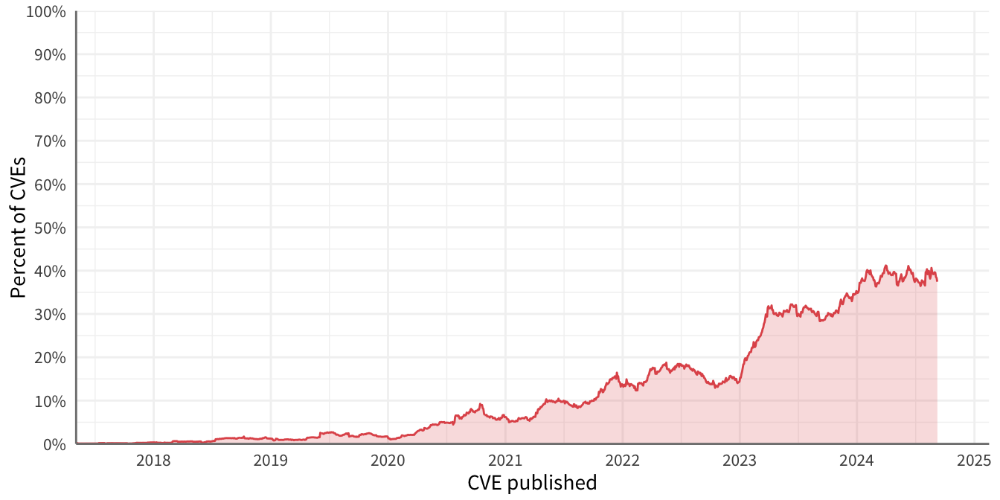{width=672}
:::
:::

## Source

From the schema:

"This is the source information (who discovered it, who researched it, etc.) and optionally a chain of CNA information (e.g. the originating CNA and subsequent parent CNAs who have processed it before it arrives at the MITRE root). Must contain: IF this is in the root level it MUST contain a CNA_chain entry, IF this source entry is NOT in the root (e.g. it is part of a vendor statement) then it must contain at least one type of data entry.",

But in reality, Cisco is the only CNA using this, and the only value appears to be in the "source.defects" and they all appear to look like "CSCvz91984", "CSCvz93493", "CSCvz93504"

::: {.cell}

:::

## Tags

::: {.cell}
::: {.cell-output-display}
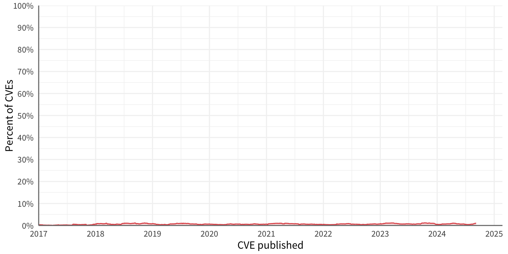{width=672}
:::
:::

## Taxonomy Mappings

As of 2024-09-07, there are a 2 CVEs from 2023 with ATT&CK mappings...

::: {.cell}
::: {.cell-output-display}
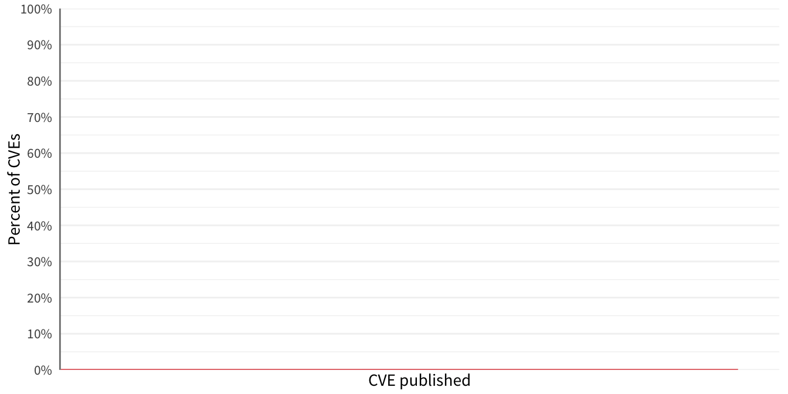{width=672}
:::
:::

# Everything

This summarizes the last point in all of the line plots above, looking at each value over the last 90 days.

::: {.cell}
::: {.cell-output-display}
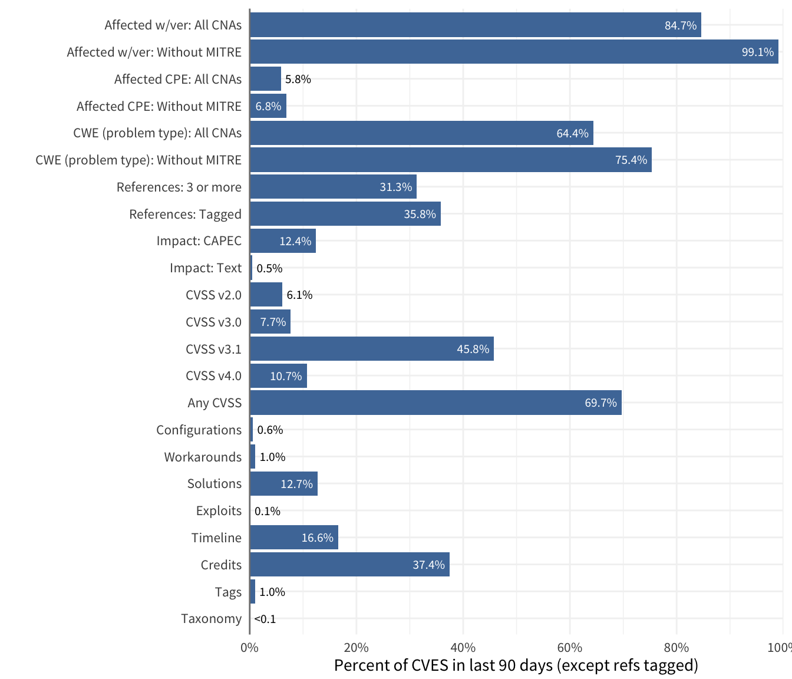{width=672}
:::
:::

### Date Consistency

This normalizes the various date formats present in the data and compares across the date fields.

The percent shown is the percent of date values within each date field and not CVE records or across all date values.

::: {.cell}
::: {.cell-output-display}
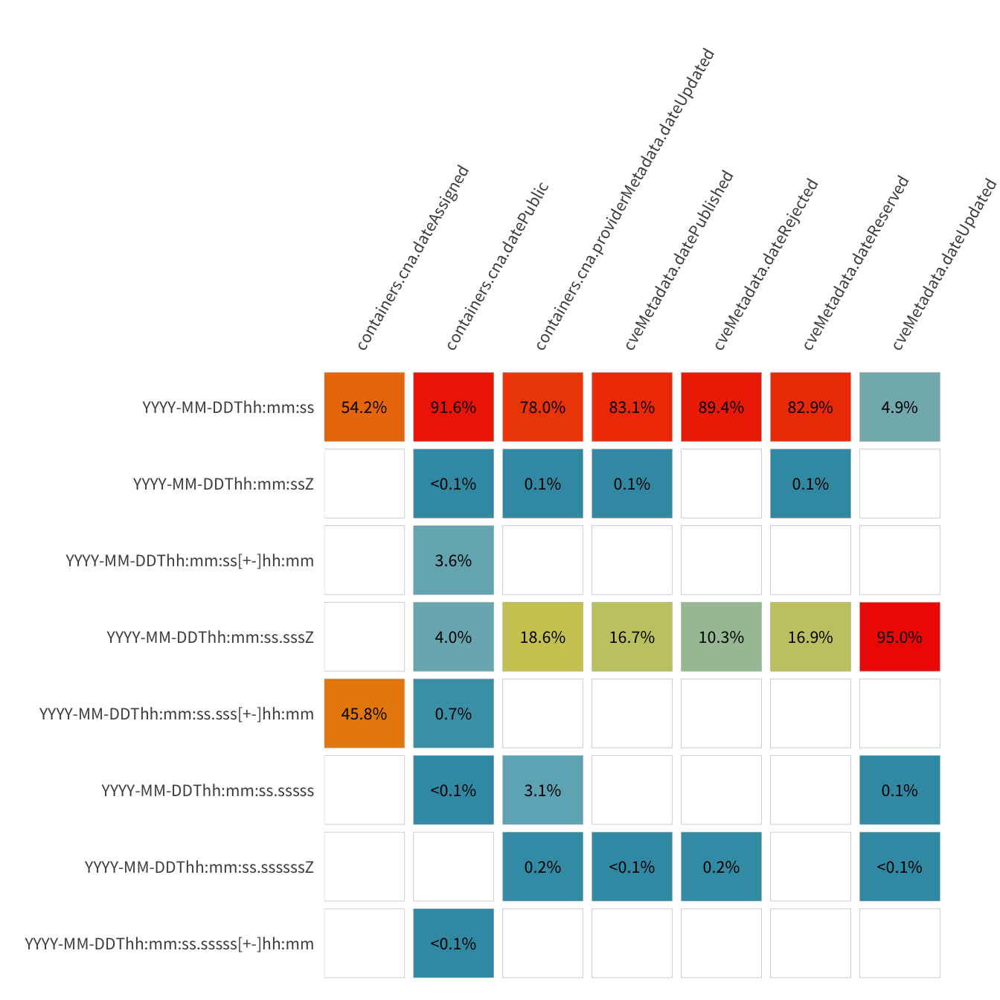{width=672}
:::
:::

